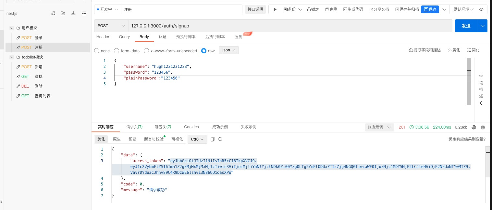

# NestJS 封装完成的简易ToDo后端系统
## 功能描述
- 基于nestjs框架，将框架原有http模块替换成Fastify；将内置日志模块替换成Winston，且实现日志记录持久化功能
- 实现用户注册和登录颁发jwt令牌，以及建议的todolist模块Crud功能

## 技术栈
- nestjs - 一个使用typescript构建的企业级Nodejs框架
- typeorm - 一个node+ts构建的orm
- class-validator - 用于验证ts类
- class-transform - 用于序列化ts对象
- 数据库采用MySQL

## 文件结构
```shell
src
├── app.module.ts                         #框架默认文件
├── common                                #通用模块
│   ├── constraints                       #自定义验证类
│   ├── decorators                        #装饰器集合
│   ├── dtos                              #dto集合
│   ├── filters                           #过滤器
│   └── guards                            #守卫
|   └── interceptors                      #拦截器
|   └── eumn                              #常用枚举模块
└── user                                  # 用户模块
|    ├── user.module.ts                    #社区模块
|    ├── controllers                       #控制器
|    ├── dtos                              #请求数据验证DTO
|    ├── entities                          #实体模型
|    ├── repositories                      #操作数据的自定义存储类
|    ├── services                          #服务类
|    └── subscribers                       #用于执行查询钩子的订阅者类
└── auth                                  # 模块布局跟上述user、common模块类似
└── memo                                  # ...
.env                                  #配置信息
.env.development                      #配置信息
.env.development                  #配置信息
```

## 安装启动
- 下载源码：https://github.com/zhuxubin/nestjs-api-sample
- 安装依赖项目和启动项目
```
 nestjs-api-sample ** pnpm install
 pnpm start:dev
```

## 接口文档



